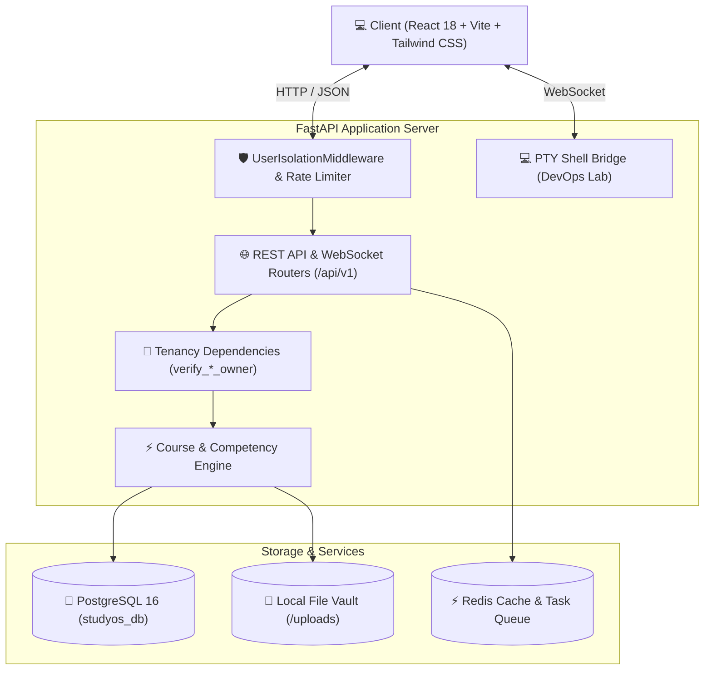

<div align="center">

# 🌌 Omnidesk BD
### *The Universal Autonomous Learning & Engineering Operating System*

[](https://github.com/thesabbirbd/Omnidesk-BD)
[](https://fastapi.tiangolo.com)
[](https://react.dev)
[](https://tailwindcss.com)
[](https://www.postgresql.org)
[](#-offline-first-architecture)
[](https://opensource.org/licenses/MIT)

<p align="center">
  <b>Transform how you learn, architect, and master technology.</b><br>
  A local-first, distraction-free operating system with DAG visual roadmaps, AI document parsing, anti-fake-progress verification, real-time presence detection, and sandboxed DevOps terminals.
</p>

[✨ Key Features](#-key-features) • [🏛️ Architecture](#-system-architecture) • [🚀 Quickstart](#-quickstart-guide) • [🧪 DevOps Lab](#-sandboxed-devops-lab) • [🛡️ Security](#-security--tenancy) • [🗺️ Roadmap](#-roadmap)

---

</div>

## 💡 What is Omnidesk BD?

**Omnidesk BD** is an evidence-based learning operating system engineered specifically for software engineers, backend architects, and DevOps practitioners. 

Rather than relying on passive video consumption or vanity metrics, **Omnidesk BD enforces genuine engineering competency**:
- 📚 **No Invented Facts**: Every extracted topic links directly to its source material with verifiable confidence scores.
- 🎯 **Competency Verification Gates**: You cannot mark a skill complete without verifying evidence across explanation, implementation, and debugging.
- ⚡ **Anti-Fake-Progress Velocity Guard**: Automated monitoring detects unrealistic completion speeds and logs audit flags.
- ⏱️ **True Route-Persistent Timer**: A floating, draggable focus HUD that survives all page navigations and checks physical study presence locally.

---

## ✨ Key Features

### 🧠 1. Universal StudySpace Engine
- **Multilingual Support**: Configure independent languages for Interface, Learning Content, and Source Documents (`interface_language`, `learning_language`, `source_language`).
- **Any Course, Any Roadmap**: Seamlessly generates complete curriculums from plain text, bullet roadmaps, or syllabus prompts.
- **Automated Document Processing**: Upload PDFs, DOCX, or Markdown files. Text is extracted, SHA-256 hashed, and transformed into interactive course DAGs with page-level citations.

### 🗺️ 2. Visual Interactive MindMap (`@xyflow/react`)
- **Reactive Node Graph**: Visualize topics as interactive nodes on an infinite canvas with zoom, pan, and minimap controls.
- **DAG Dependency Enforcement**: Cycle-detection algorithms prevent circular prerequisites.
- **6-State Mastery Progression**:
  - `⚪ NORMAL` → Unstarted topic
  - `🔵 LEARNING` → Actively studying
  - `🟢 COMPLETE` → Verified with hands-on competency items
  - `🔴 BLOCKED` → Prerequisites unmet
  - `🟣 REVIEW` → Spaced repetition interval reached
  - `⭐ MASTERED` → Retained through spaced assessments

### ⏱️ 3. Resilient Global Focus Timer & Local Presence HUD
- **Route-Survivable Clock**: Survives React route changes and reloads using Unix timestamp math.
- **Draggable Glass HUD**: Shrinks into a sleek circular timer pill with smooth blur physics on mouse hover.
- **Optical Presence Detection**: Uses local browser `FaceDetector` API snapshots (zero video recorded or saved) to automatically pause timer when you step away from your desk.

### 🧪 4. Sandboxed DevOps Lab Terminal
- **Native Xterm.js & PTY Bridge**: Live interactive bash shell embedded directly into the web UI.
- **WebSocket Streaming**: Run commands, inspect Docker containers, review logs, and practice shell scripting without switching windows.

### 🛠️ 5. Engineering Debug Lab (*"I'm Stuck"*)
- **Structured Debug Journals**: Record symptoms, reproduce logs, explore hypotheses, and log root causes.
- **Local AI Hypothesis Engine**: 100% offline advisory heuristics suggest systematic troubleshooting vectors without external API calls.

### 🎨 6. Multi-Material Design System
- **Apple iOS Frosted Glass**: Ultra-fluid background blur (`backdrop-blur-xl`) with saturated highlights.
- **Tactile Claymorphism**: Soft, rounded neomorphic depths with gentle drop shadows.
- **Sleek Neumorphism**: Inset and extruded physical surface contours.
- **Atmospheric Gradients**: Cyber Aurora, Sunset Radiant, and Emerald Nebula.

---

## 🏛️ System Architecture



---

## 🛠️ Technology Stack

| Layer | Technologies |
| :--- | :--- |
| **Frontend Core** | React 18.3, Vite 8, React Router v7, Tailwind CSS v4 |
| **Visual Canvas** | React Flow (`reactflow`), Lucide React, Lucide Icons |
| **Terminal & Lab** | Xterm.js 5.3, Xterm Addon Fit, Python PTY (`pty.openpty`) |
| **Backend Framework**| FastAPI 0.110+, Uvicorn (ASGI), Pydantic v2 |
| **Database & ORM** | PostgreSQL 16, SQLAlchemy 2.0 (Mapped Columns), Alembic Migrations |
| **Security & Auth** | JWT (HS256 Access & Refresh Tokens), Bcrypt Password Hashing |
| **Task Queue & Caching**| Redis 7, Celery Task Worker, In-Memory Fallback Queue |
| **Offline Sync** | Service Worker PWA, IndexedDB (`OmnideskBD_Offline_DB`) |

---

## 🚀 Quickstart Guide

### Prerequisites
- **Python**: 3.12+
- **Node.js**: 18+ and `npm`
- **PostgreSQL**: 14+ running on port `5432`
- **Redis** (Optional): Running on port `6379` (In-memory fallback activates automatically if Redis is absent)

---

### Step 1: Clone the Repository
```bash
git clone https://github.com/thesabbirbd/Omnidesk-BD.git
cd Omnidesk-BD
```

---

### Step 2: Backend Setup
```bash
cd backend

# Create and activate virtual environment
python3 -m venv .venv
source .venv/bin/activate

# Install Python dependencies
pip install -r requirements.txt

# Configure environment
cp ../.env.example .env

# Run database migrations
PYTHONPATH=. alembic upgrade head

# Start FastAPI dev server
python main.py
```
> 📍 **API Documentation**: Open [http://localhost:8000/docs](http://localhost:8000/docs) (Swagger UI) or `/redoc`.

---

### Step 3: Frontend Setup
In a new terminal window:
```bash
cd frontend

# Install dependencies
npm install

# Start Vite development server
npm run dev
```
> 🌐 **Web Interface**: Open [http://localhost:5173](http://localhost:5173) in your modern browser.

---

### Step 4: Run with Docker Compose (Production Setup)
```bash
docker compose up -d --build
```
Access the complete stack at [http://localhost:8080](http://localhost:8080).

---

## 🧪 Verification & Test Suites

Omnidesk BD maintains a **100% passing test suite** covering auth, multilingual schemas, provenance tracking, and tenancy isolation:

```bash
cd backend
source .venv/bin/activate

# 1. Comprehensive Phase 1 Suite (Tenancy, Provenance, Multilingual)
PYTHONPATH=. python tests/test_phase1_provenance_isolation.py

# 2. Authentication & Profile Isolation Suite
PYTHONPATH=. python tests/test_auth_phase1.py

# 3. Universal Course Generator & Competency Engine Suite
PYTHONPATH=. python tests/test_universal_engine_phase2.py

# 4. Command Center, Weakness Detector & Debug Lab Suite
PYTHONPATH=. python tests/test_phase3_advanced.py

# 5. Health Probes, Task Queue, Analytics & DevOps PTY Terminal Suite
PYTHONPATH=. python tests/test_phase4_5_6.py
```

---

## 🛡️ Security & Tenancy Invariants

1. **Strict Tenancy Isolation**: Every `StudySpace`, `Topic`, `Task`, `Material`, and `StudySession` has a non-nullable foreign key to `users.id`.
2. **UserIsolationMiddleware**: Automatically inspects JWT tokens, verifies route parameters, and defends against `X-User-ID` header spoofing or query parameter injection with `403 Forbidden`.
3. **No Third-Party Paid API Reliance**: Works 100% offline. AI features run against local heuristic engines or self-hosted Ollama instances.
4. **Hardware Privacy**: Web camera presence detection operates exclusively in client RAM via browser frame buffers and closes immediately after inspection.

---

## 📂 Project Structure

```
Omnidesk-BD/
├── backend/
│   ├── alembic/                # Database migrations & version history
│   ├── app/
│   │   ├── api/                # FastAPI endpoint routers
│   │   │   ├── auth.py         # JWT register, login, refresh
│   │   │   ├── deps.py         # Tenancy ownership dependencies
│   │   │   ├── lab.py          # PTY shell WebSocket bridge
│   │   │   ├── study_spaces.py # Universal StudySpace CRUD & generators
│   │   │   ├── topics.py       # DAG topics & competency gates
│   │   │   ├── tasks.py        # Isolated user tasks & provenance
│   │   │   └── sessions.py     # Global focus timer sessions
│   │   ├── core/               # App configuration, security, & middleware
│   │   │   ├── auth_middleware.py # Tenancy boundary enforcement
│   │   │   ├── config.py       # Pydantic v2 settings
│   │   │   └── security.py     # Bcrypt & JWT engines
│   │   ├── models/             # SQLAlchemy 2.0 declarative models
│   │   ├── schemas/            # Pydantic serialization schemas
│   │   └── services/           # Course generator, document processor, AI adapter
│   ├── tests/                  # Verification test suites
│   ├── main.py                 # FastAPI application entrypoint
│   └── requirements.txt        # Backend dependencies
├── frontend/
│   ├── public/                 # Favicons, PWA manifest, service worker
│   ├── src/
│   │   ├── components/         # Dashboard widgets, modals, timer HUD, mindmap
│   │   ├── context/            # Global TimerContext & ThemeContext
│   │   ├── pages/              # Dashboard, MindMap, Lab, Command Center, Settings
│   │   ├── services/           # Offline sync, presence detection, API client
│   │   └── main.jsx            # React root mount
│   ├── index.html              # HTML shell & font definitions
│   └── package.json            # Node dependencies
├── docker-compose.yml          # Complete production orchestration
├── CHANGELOG.md                # Semantic version release log
├── PROJECT_AUDIT.md            # Comprehensive architectural audit
├── VERSION                     # Current version baseline (1.2.4)
└── README.md                   # Project documentation
```

---

## 👨‍💻 Author & Maintainer

Developed with ❤️ by **[Sabbir](https://github.com/thesabbirbd)**.

- **GitHub**: [@thesabbirbd](https://github.com/thesabbirbd)
- **Repository**: [https://github.com/thesabbirbd/Omnidesk-BD](https://github.com/thesabbirbd/Omnidesk-BD)

---

<div align="center">
  <sub>Built for engineers who demand authentic mastery. Star ⭐ this repository if you find it useful!</sub>
</div>
