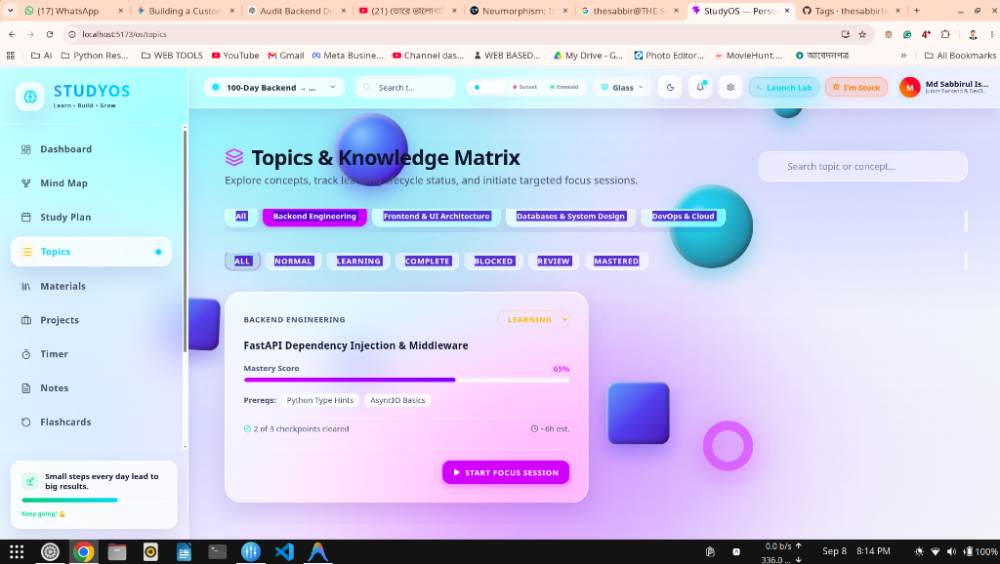
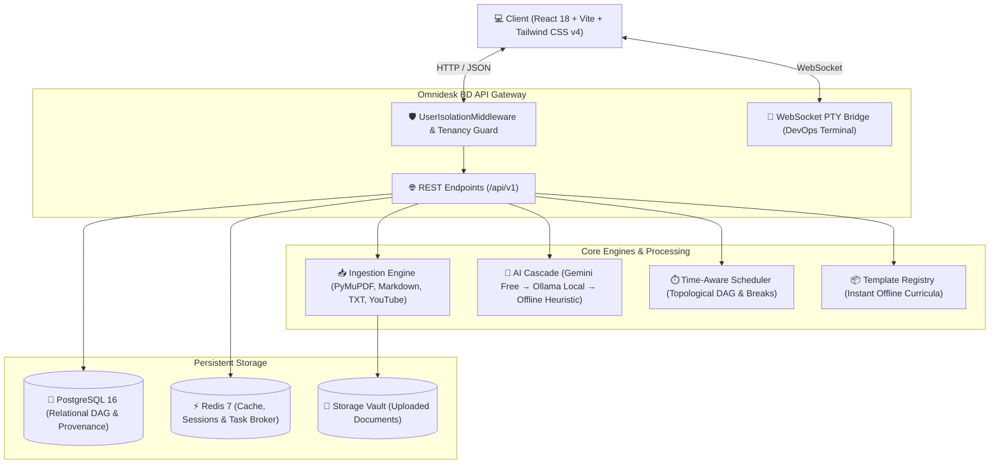

<div align="center">

# 🌌 Omnidesk BD
### *The Universal Autonomous Learning & Engineering Operating System*

<p align="center">
  <a href="https://github.com/thesabbirbd/Omnidesk-BD"></a>
  <a href="https://fastapi.tiangolo.com"></a>
  <a href="https://react.dev"></a>
  <a href="https://tailwindcss.com"></a>
  <a href="https://www.postgresql.org"></a>
  <a href="#-100-offline-first--zero-paid-dependency-guarantee"></a>
  <a href="https://opensource.org/licenses/MIT"></a>
</p>

<p align="center">
  <b>Architected for engineers who demand authentic, evidence-based mastery.</b><br>
  A distraction-free, local-first operating system pairing topological DAG visual roadmaps, multi-format AI ingestion,<br>
  anti-fake-progress competency gates, persistent focus timer physics, and a sandboxed DevOps terminal.
</p>

<p align="center">
  <a href="https://github.com/thesabbirbd/Omnidesk-BD"></a>
  <a href="http://localhost:5173"></a>
  <a href="http://localhost:8000/docs"></a>
  <a href="https://github.com/thesabbirbd/Omnidesk-BD/issues"></a>
</p>

---

### 🖥️ High-Fidelity Glassmorphic Dashboard Preview

<div align="center">
  
  <p><i>Figure 1: Omnidesk BD command center with frosted glass panels, topological mindmap, persistent timer, and dark/light gradients.</i></p>
</div>

---

</div>

## 📑 Table of Contents

- [💡 What is Omnidesk BD?](#-what-is-omnidesk-bd)
- [🎨 Design Engine (Glass, Clay & Neumorphism)](#-design-engine)
- [⚡ Core Capabilities](#-core-capabilities)
  - [1. Universal Ingestion & Course Pipeline](#1-universal-ingestion--course-pipeline)
  - [2. The Strict Analyze → Preview → Approve Flow](#2-the-strict-analyze--preview--approve-flow)
  - [3. Visual DAG MindMap (`@xyflow/react`)](#3-visual-dag-mindmap-xyflowreact)
  - [4. Time-Aware Scheduling & Deep-Work Engine](#4-time-aware-scheduling--deep-work-engine)
  - [5. Route-Persistent Focus HUD & Optical Presence](#5-route-persistent-focus-hud--optical-presence)
  - [6. Embedded Sandboxed DevOps Lab (Xterm.js + PTY)](#6-embedded-sandboxed-devops-lab-xtermjs--pty)
  - [7. Engineering Debug Lab (*"I'm Stuck"*)](#7-engineering-debug-lab-im-stuck)
  - [8. Predefined Curriculum Template Registry](#8-predefined-curriculum-template-registry)
- [🏛️ System Architecture](#-system-architecture)
- [🛠️ Technology Stack](#-technology-stack)
- [🚀 Quickstart Guide](#-quickstart-guide)
- [🧪 Verification & Test Suites](#-verification--test-suites)
- [🛡️ Security & Tenancy Invariants](#-security--tenancy-invariants)
- [📂 Project Structure](#-project-structure)
- [👨‍💻 Author & Maintainer](#-author--maintainer)

---

## 💡 What is Omnidesk BD?

Most online learning tools rely on passive video streams, linear checklists, and vanity completion percentages. **Omnidesk BD is fundamentally different.** It is built on first-principles cognitive science and engineering discipline:

| Traditional E-Learning | Omnidesk BD System |
| :--- | :--- |
| ❌ Passive video watching | 🎯 **Active Competency Gates**: Must prove Explanation, Hands-On Implementation & Debugging |
| ❌ Silently hallucinated facts | 📚 **Verified Grounding**: Every generated topic links directly to source citations |
| ❌ Click-to-complete vanity metrics | ⚡ **Anti-Fake-Progress Velocity Guard**: Audits completion intervals against realistic pacing |
| ❌ Disconnected from practical tools | 💻 **Integrated PTY Shell**: Live interactive Linux terminal embedded inside your study flow |
| ❌ Timers reset on page refresh | ⏱️ **True Global Clock**: Floating glass HUD survives all page changes with optical presence check |
| ❌ Forced cloud API subscriptions | 🛡️ **100% Offline Capable**: Zero paid dependencies, works seamlessly without internet |

---

## 🎨 Design Engine

Omnidesk BD features an adaptive multi-material design system engineered with modern Tailwind CSS v4 design tokens:

| Material Style | Visual Characteristics | Best Used For |
| :--- | :--- | :--- |
| **💎 Apple Frosted Glass** | `backdrop-blur-xl`, translucent specular highlights, glowing cyan/purple borders | Top navigation bar, floating HUD widgets, action dialogs |
| **🫧 Tactile Claymorphism** | Soft organic 3D pill depth, dual-layer drop shadows, rounded pill buttons | Interactive badge toggles, action triggers, quick-links |
| **📐 Sleek Neumorphism** | Physical debossed inset shadows, tactile extruded surfaces | Form inputs, search fields, markdown note editor canvas |
| **🌈 Atmospheric Gradients** | Cyber Aurora, Sunset Radiant, and Emerald Nebula background palettes | Immersive, distraction-free night and day learning modes |

---

## ⚡ Core Capabilities

### 1. Universal Ingestion & Course Pipeline
- **Multi-Format Parsers**: Modular Python adapters automatically ingest **PDF** (via high-performance PyMuPDF with pypdf fallback), **Markdown** (frontmatter & header chunking), **Plain Text**, and **YouTube Transcripts** (with graceful fallback handling).
- **Cryptographic Grounding**: Every ingested source generates a canonical SHA-256 integrity hash and segment-level timestamps.

### 2. The Strict Analyze → Preview → Approve Flow
Omnidesk BD adheres to the strict safety invariant: **NEVER silently write AI-generated data to the database.**
```
[ User Input / PDF / Goal ]
          │
          ▼
   Ingestion Engine (Extract & Clean)
          │
          ▼
   AI Abstraction Layer (Gemini / Ollama / Offline Heuristic)
          │
          ▼
   POST /study-spaces/generate (Returns JSON Preview, 0 DB Writes)
          │
          ▼
   [ User Reviews & Customizes Preview ]
          │
          ▼
   POST /study-spaces/approve (Persists StudySpace, Topics, DAG & Plan to PostgreSQL)
```

### 3. Visual DAG MindMap (`@xyflow/react`)
- **Reactive Canvas**: Interactive nodes rendered on an infinite canvas with minimap, controls, and physics-driven bezier curves.
- **Topological Graph**: Cycle-detection algorithms prevent recursive prerequisites.
- **6-State Mastery Progression**:
  - `⚪ NORMAL` — Unstarted topic
  - `🔵 LEARNING` — Actively studying
  - `🟢 COMPLETE` — Verified through hands-on competency checkpoints
  - `🔴 BLOCKED` — Locked until prerequisites are completed
  - `🟣 REVIEW` — Spaced repetition interval trigger reached
  - `⭐ MASTERED` — Long-term retention established

### 4. Time-Aware Scheduling & Deep-Work Engine
- **Kahn's Topological Sort**: Automatically sequences topics so fundamental concepts are mastered before dependent skills.
- **Session Chunking**: Automatically breaks large topics into focused 30–60 minute deep-work sessions.
- **Cognitive Breaks**: Inserts 10–15 minute mental recovery intervals between intensive sessions.
- **Milestone Labs**: Automatically schedules hands-on integration checkpoints after finishing a cluster of prerequisites.
- **Sprint Mode**: Capable of fitting prioritized learning into specific time limits (e.g. 180-minute sprint).

### 5. Route-Persistent Focus HUD & Optical Presence
- **Route-Survivable Clock**: Survives full React route navigations, modal popups, and tab changes using Unix timestamp math.
- **Draggable Glass Pill**: Shrinks into a sleek circular timer with smooth blur physics on mouse hover.
- **Local Optical Presence Detection**: Uses client-side browser `FaceDetector` API snapshots (zero video or frames saved to disk) to pause the timer automatically if you step away from your desk.

### 6. Embedded Sandboxed DevOps Lab (Xterm.js + PTY)
- **Live Terminal**: Native interactive bash shell embedded directly into the browser.
- **WebSocket Streaming**: Run Docker commands, inspect Kubernetes pods, execute Python scripts, and test shell syntax without leaving your study dashboard.

### 7. Engineering Debug Lab (*"I'm Stuck"*)
- **Structured Debug Journals**: Systematic incident troubleshooting workflow (Symptoms → Logs → Hypotheses → Root Cause).
- **Local Hypothesis Generator**: 100% offline advisory heuristics suggest systematic troubleshooting angles.

### 8. Predefined Curriculum Template Registry
- Production-grade curricula stored as version-controlled JSON templates in [`backend/templates/registry/`](file:///home/thesabbir/Documents/Project%20Backend%20-%20DevOps/universal-study-os/backend/templates/registry):
  - **Backend & DevOps Masterclass** (`backend-devops.json`)
  - **Modern Python 3.12 Engineering** (`python.json`)
  - **Cloud Native Architecture & Microservices** (`cloud-native.json`)
- Instant loading and preview without external API latency.

---

## 🏛️ System Architecture



---

## 🛠️ Technology Stack

| Layer | Component | Technologies |
| :--- | :--- | :--- |
| **Frontend UI** | Core Framework | React 18.3, Vite 8, React Router v7 |
| **Styling** | Design System | Tailwind CSS v4, Lucide React Icons, Custom Glassmorphism CSS |
| **Visual Graph** | DAG Canvas | React Flow (`@xyflow/react`), Bezier Edges, Auto-Layout |
| **Terminal Lab** | Web Terminal | Xterm.js 5.3, Xterm Addon Fit, WebSocket protocol |
| **Backend API** | App Server | FastAPI 0.110+, Uvicorn ASGI, Pydantic v2 |
| **Database** | Relational Data | PostgreSQL 16, SQLAlchemy 2.0 (Mapped Columns), Alembic Migrations |
| **Terminal PTY** | Linux Shell Bridge | Python `pty.openpty`, `termios`, asynchronous subprocess streams |
| **Ingestion** | Document Parser | PyMuPDF (fitz) 1.28, pypdf, youtube-transcript-api |
| **AI Intelligence** | Multi-Tier Cascade | Google Gemini (Free-Tier), Ollama (Local LLMs), Offline Heuristic Graph |
| **Task Queue** | Background Workers | Redis 7, Celery Task Worker, In-Memory Fallback Queue |
| **Offline Sync** | PWA & Storage | Service Worker PWA, IndexedDB (`OmnideskBD_Offline_DB`) |

---

## 🚀 Quickstart Guide

### Prerequisites
- **Python**: 3.12+
- **Node.js**: 18+ and `npm`
- **PostgreSQL**: 14+ running on port `5432`
- **Redis** (Optional): Running on port `6379` *(In-memory fallback activates automatically if Redis is absent)*

---

### Step 1: Clone the Repository
```bash
git clone https://github.com/thesabbirbd/Omnidesk-BD.git
cd Omnidesk-BD
```

---

### Step 2: Backend Setup
```bash
cd backend

# Create and activate Python virtual environment
python3 -m venv .venv
source .venv/bin/activate

# Install dependencies
pip install -r requirements.txt

# Configure environment variables
cp ../.env.example .env

# Run database migrations
PYTHONPATH=. alembic upgrade head

# Start FastAPI development server
python main.py
```
> 📍 **Interactive Documentation**: Visit [http://localhost:8000/docs](http://localhost:8000/docs) (Swagger UI) or `/redoc`.

---

### Step 3: Frontend Setup
In a new terminal:
```bash
cd frontend

# Install Node packages
npm install

# Start Vite hot-reloading development server
npm run dev
```
> 🌐 **Web Interface**: Open [http://localhost:5173](http://localhost:5173) in your modern web browser.

---

### Step 4: Docker Compose Orchestration (Production Ready)
```bash
docker compose up -d --build
```
Access the complete orchestrated stack at [http://localhost:8080](http://localhost:8080).

---

## 🧪 Verification & Test Suites

Omnidesk BD maintains a **100% passing test suite** verifying tenancy boundaries, AI provider cascades, and non-silent database mutations:

```bash
cd backend
source .venv/bin/activate

# 1. Generation Preview, Approval Persistence & Time-Aware Scheduler Suite
PYTHONPATH=. python tests/test_phase1_generate_approve.py

# 2. Multi-Format Ingestion (PDF, MD, TXT, YouTube) & AI Abstraction Cascade Suite
PYTHONPATH=. python tests/test_phase1_ingestion_ai.py

# 3. Comprehensive Tenancy Isolation, Data Provenance & Multilingual Schemas Suite
PYTHONPATH=. python tests/test_phase1_provenance_isolation.py

# 4. Authentication, Session Lifespans & User Profile Isolation Suite
PYTHONPATH=. python tests/test_auth_phase1.py

# 5. Course Generator, React Flow Coordinates & Competency Engine Suite
PYTHONPATH=. python tests/test_universal_engine_phase2.py

# 6. Command Center, Retrospective Analytics & Debug Lab Suite
PYTHONPATH=. python tests/test_phase3_advanced.py

# 7. Health Probes, Task Queue & DevOps PTY Terminal Suite
PYTHONPATH=. python tests/test_phase4_5_6.py
```

---

## 🛡️ Security & Tenancy Invariants

1. **Strict User Isolation**: Every database entity (`StudySpace`, `Topic`, `Task`, `Material`, `StudySession`) has an indexed, non-nullable foreign key referencing `users.id`.
2. **Impersonation Defense**: `UserIsolationMiddleware` inspects incoming JWT tokens and intercepts any header spoofing (`X-User-ID`) or query parameter tenancy mismatches with `403 Forbidden`.
3. **100% Offline-First & Zero Paid Dependency Guarantee**: Core features operate completely without network connectivity or paid API keys. The deterministic heuristic engine resolves technology dependency graphs locally.
4. **Hardware Privacy Protection**: Optical presence detection executes entirely inside client RAM through browser APIs. Zero camera frames are recorded, stored, or transmitted.

---

## 📂 Project Structure

```
Omnidesk-BD/
├── backend/
│   ├── alembic/                # Database migrations & version history
│   ├── app/
│   │   ├── ai/                 # AI Abstraction Layer (Gemini, Ollama, Offline Heuristic)
│   │   ├── api/                # FastAPI endpoint routers (Auth, Spaces, Topics, Lab)
│   │   ├── core/               # Middleware, security configs, JWT & tenancy rules
│   │   ├── db/                 # Database engine & session lifespans
│   │   ├── ingestion/          # Multi-format document & media ingestion parsers
│   │   ├── models/             # SQLAlchemy 2.0 declarative database models
│   │   ├── schemas/            # Pydantic v2 request & response schemas
│   │   └── services/           # Scheduler, templates, course generator & PTY bridge
│   ├── templates/registry/     # Pre-configured curriculum JSON templates
│   ├── tests/                  # Automated verification test suites
│   ├── main.py                 # FastAPI application entrypoint
│   └── requirements.txt        # Python backend dependencies
├── frontend/
│   ├── public/                 # PWA manifest, service workers, icons
│   ├── src/
│   │   ├── components/         # Glassmorphic dashboard widgets, modals, timer HUD
│   │   ├── context/            # Global TimerContext & ThemeContext
│   │   ├── pages/              # Dashboard, MindMap, Lab, Notes, Projects, Settings
│   │   ├── services/           # Offline sync, presence detection, API client
│   │   └── main.jsx            # Application root mount
│   ├── index.html              # HTML shell & font definitions
│   └── package.json            # Node frontend dependencies
├── docs/images/                # UI screenshots & preview assets
├── docker-compose.yml          # Production multi-container orchestration
├── CHANGELOG.md                # Release milestone history
├── PROJECT_AUDIT.md            # Comprehensive codebase audit
├── VERSION                     # Semantic version baseline (1.2.4)
└── README.md                   # Project documentation
```

---

## 👨‍💻 Author & Maintainer

Developed with ❤️ by **[Sabbir](https://github.com/thesabbirbd)**.

* 🌐 **GitHub**: [@thesabbirbd](https://github.com/thesabbirbd)
* 📦 **Repository**: [https://github.com/thesabbirbd/Omnidesk-BD](https://github.com/thesabbirbd/Omnidesk-BD)

---

<div align="center">
  <sub>Built for engineers who demand authentic mastery. If you find Omnidesk BD useful, please consider giving it a ⭐ star!</sub>
</div>
